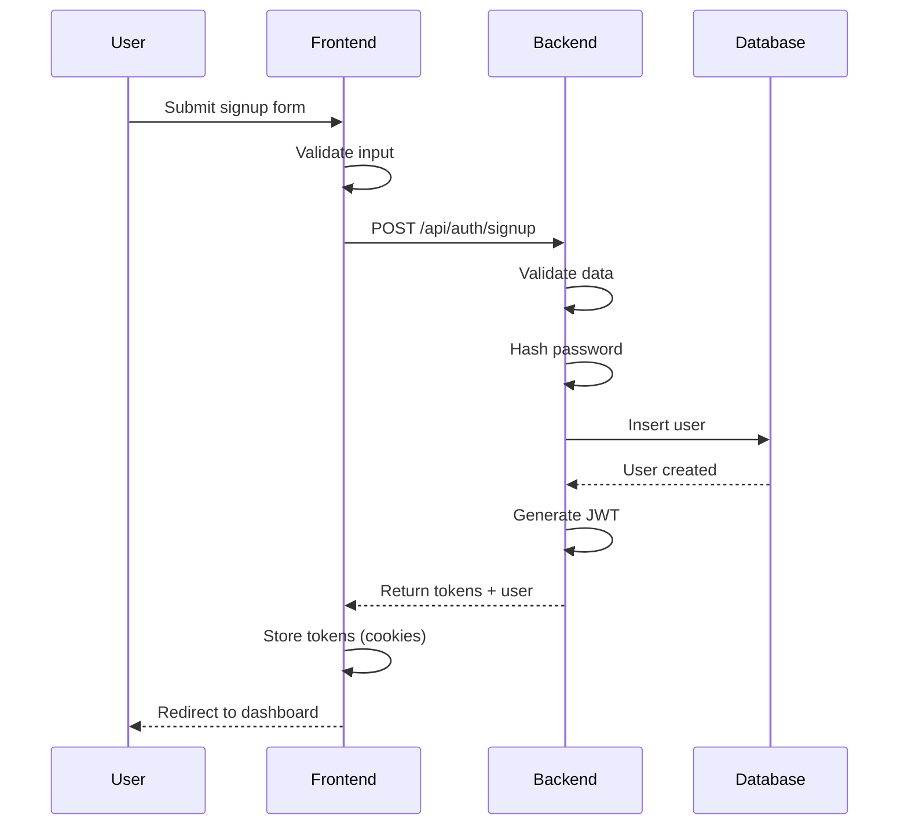
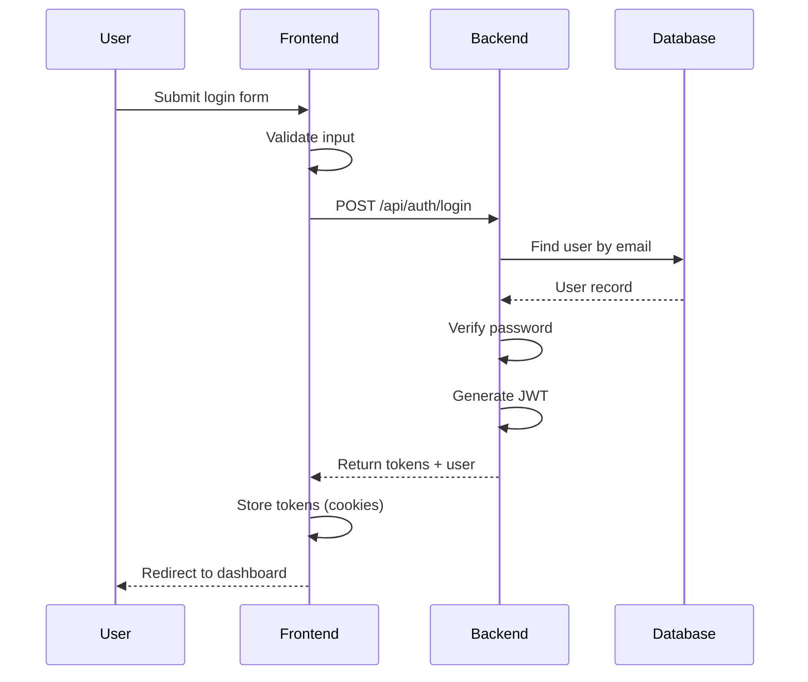
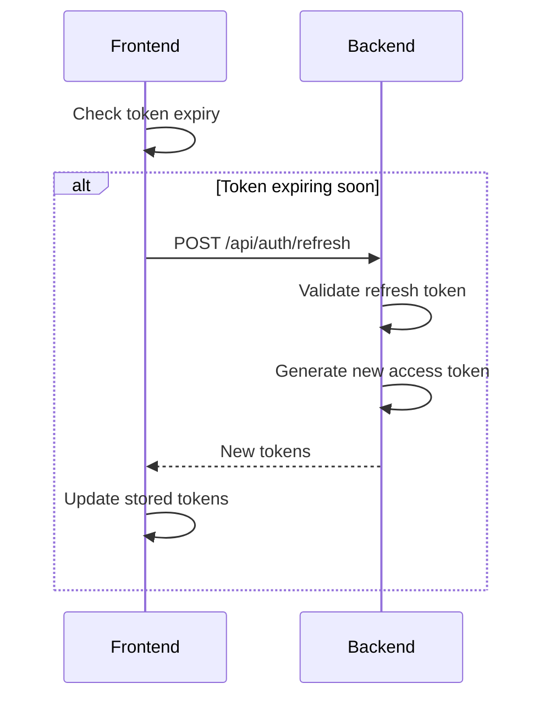

# Authentication Feature Specification

**Feature**: User Authentication
**Version**: 2.0
**Phase**: Phase 2
**Author**: Spec-Driven Development
**Date**: December 2024

---

## Overview

This specification defines the authentication system for the Todo Web Application using **Better Auth** for JWT-based authentication across the Next.js frontend and FastAPI backend.

### Implementation Status: ✅ COMPLETE

**Technology**: Better Auth (https://www.better-auth.com/)

**Architecture**:
- **Frontend**: Better Auth client handles signup, login, logout, and session management
- **Backend**: FastAPI validates JWT tokens via JWKS endpoint (`/api/auth/jwks`)
- **Database**: Better Auth manages its own tables (user, session, account, verification)

---

## Authentication Flow

### 1. Email/Password Registration



### 2. Email/Password Login



### 3. Token Refresh Flow



---

## Data Models

### User Model

```python
class User(SQLModel, table=True):
    __tablename__ = "users"
    
    id: str = Field(default_factory=lambda: str(uuid4()), primary_key=True)
    email: str = Field(unique=True, index=True, max_length=255)
    password_hash: str = Field(max_length=255)
    name: str = Field(max_length=100)
    created_at: datetime = Field(default_factory=datetime.utcnow)
    updated_at: datetime = Field(default_factory=datetime.utcnow)
```

### Session Model (Optional)

```python
class Session(SQLModel, table=True):
    __tablename__ = "sessions"
    
    id: str = Field(default_factory=lambda: str(uuid4()), primary_key=True)
    user_id: str = Field(foreign_key="users.id", index=True)
    token_hash: str = Field(max_length=255)
    expires_at: datetime
    created_at: datetime = Field(default_factory=datetime.utcnow)
```

---

## API Endpoints

### POST /api/auth/signup

**Request:**
```json
{
  "email": "user@example.com",
  "password": "SecurePass123!",
  "name": "John Doe"
}
```

**Validation:**
- `email`: Valid email format, unique
- `password`: Min 8 chars, 1 uppercase, 1 number, 1 special char
- `name`: 2-100 characters

**Response (201):**
```json
{
  "success": true,
  "data": {
    "user": {
      "id": "uuid",
      "email": "user@example.com",
      "name": "John Doe"
    },
    "access_token": "jwt-token",
    "refresh_token": "refresh-token",
    "expires_in": 604800
  }
}
```

**Errors:**
- `400`: Validation errors
- `409`: Email already exists

### POST /api/auth/login

**Request:**
```json
{
  "email": "user@example.com",
  "password": "SecurePass123!"
}
```

**Response (200):**
```json
{
  "success": true,
  "data": {
    "user": {
      "id": "uuid",
      "email": "user@example.com",
      "name": "John Doe"
    },
    "access_token": "jwt-token",
    "refresh_token": "refresh-token",
    "expires_in": 604800
  }
}
```

**Errors:**
- `400`: Invalid credentials
- `401`: Account locked (optional)

### POST /api/auth/logout

**Headers:**
```
Authorization: Bearer <access_token>
```

**Response (200):**
```json
{
  "success": true,
  "message": "Logged out successfully"
}
```

### POST /api/auth/refresh

**Request:**
```json
{
  "refresh_token": "refresh-token"
}
```

**Response (200):**
```json
{
  "success": true,
  "data": {
    "access_token": "new-jwt-token",
    "expires_in": 604800
  }
}
```

**Errors:**
- `401`: Invalid or expired refresh token

### GET /api/auth/me

**Headers:**
```
Authorization: Bearer <access_token>
```

**Response (200):**
```json
{
  "success": true,
  "data": {
    "id": "uuid",
    "email": "user@example.com",
    "name": "John Doe"
  }
}
```

---

## JWT Configuration (Better Auth)

### Access Token

| Property | Value |
|----------|-------|
| Algorithm | EdDSA (Ed25519) |
| Expiration | 7 days |
| Issuer | Better Auth |
| JWKS Endpoint | `/api/auth/jwks` |

**Payload (Better Auth format):**
```json
{
  "sub": "user-uuid",
  "email": "user@example.com",
  "name": "John Doe",
  "iat": 1234567890,
  "exp": 1234567890
}
```

### Token Storage

| Token | Storage |
|-------|---------|
| Bearer Token | localStorage (`bearer_token`) |
| Session Cookie | HTTP-only cookie (managed by Better Auth) |

### Backend Validation

The FastAPI backend validates JWT tokens by:
1. Fetching JWKS from `http://localhost:3000/api/auth/jwks`
2. Verifying token signature using public keys
3. Extracting user info from token payload

---

## Password Requirements

| Requirement | Rule |
|-------------|------|
| Minimum Length | 8 characters |
| Uppercase | At least 1 |
| Lowercase | At least 1 |
| Number | At least 1 |
| Special Character | At least 1 of !@#$%^&*(),.?":{}|<> |

### Hashing

- Algorithm: bcrypt
- Salt Rounds: 12

```python
from passlib.context import CryptContext

pwd_context = CryptContext(schemes=["bcrypt"], deprecated="auto")

def hash_password(password: str) -> str:
    return pwd_context.hash(password)

def verify_password(plain: str, hashed: str) -> bool:
    return pwd_context.verify(plain, hashed)
```

---

## Frontend Integration

### Auth Context (React)

```typescript
interface AuthContextType {
  user: User | null;
  isLoading: boolean;
  isAuthenticated: boolean;
  login: (email: string, password: string) => Promise<void>;
  signup: (data: SignupData) => Promise<void>;
  logout: () => Promise<void>;
}
```

### Protected Routes

```typescript
// middleware.ts
export function middleware(request: NextRequest) {
  const token = request.cookies.get('access_token');
  const isAuthPage = request.nextUrl.pathname.startsWith('/auth');
  const isProtected = request.nextUrl.pathname.startsWith('/dashboard');

  if (isProtected && !token) {
    return NextResponse.redirect(new URL('/auth/login', request.url));
  }

  if (isAuthPage && token) {
    return NextResponse.redirect(new URL('/dashboard', request.url));
  }

  return NextResponse.next();
}
```

---

## Security Considerations

### 1. Token Storage

- Access token: HTTP-only secure cookie
- Refresh token: HTTP-only secure cookie
- Never expose tokens to JavaScript

### 2. CSRF Protection

- Use SameSite=Strict cookies
- Implement CSRF tokens for state-changing operations

### 3. Rate Limiting

| Endpoint | Rate Limit |
|----------|------------|
| /api/auth/login | 5 attempts per minute |
| /api/auth/signup | 3 attempts per minute |
| /api/auth/refresh | 10 requests per minute |

### 4. Brute Force Protection

- Account lockout after 5 failed attempts
- Exponential backoff on failures
- CAPTCHA after 3 failures (optional)

### 5. Input Validation

- Sanitize all inputs
- Validate email format
- Enforce password requirements
- Trim whitespace

---

## Error Codes

| Code | Message | HTTP Status |
|------|---------|-------------|
| AUTH_001 | Invalid credentials | 401 |
| AUTH_002 | Email already exists | 409 |
| AUTH_003 | Token expired | 401 |
| AUTH_004 | Invalid token | 401 |
| AUTH_005 | Account locked | 423 |
| AUTH_006 | Validation error | 400 |

---

## Testing Requirements

### Unit Tests

- [ ] Password hashing and verification
- [ ] JWT token generation and validation
- [ ] Input validation functions

### Integration Tests

- [ ] Signup flow
- [ ] Login flow
- [ ] Token refresh flow
- [ ] Logout flow
- [ ] Protected route access

### Security Tests

- [ ] SQL injection attempts
- [ ] XSS prevention
- [ ] Rate limiting enforcement
- [ ] Token expiration handling
